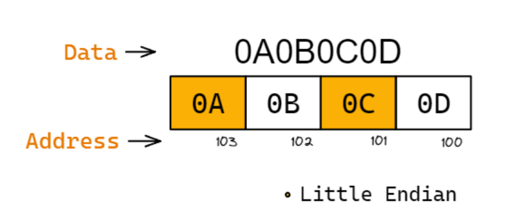
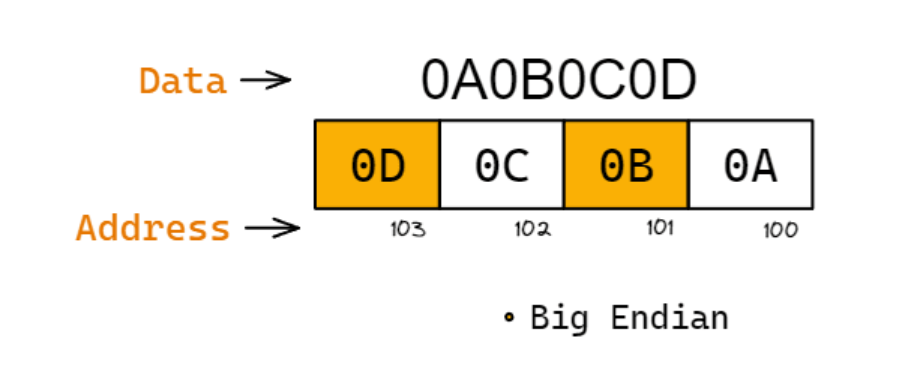
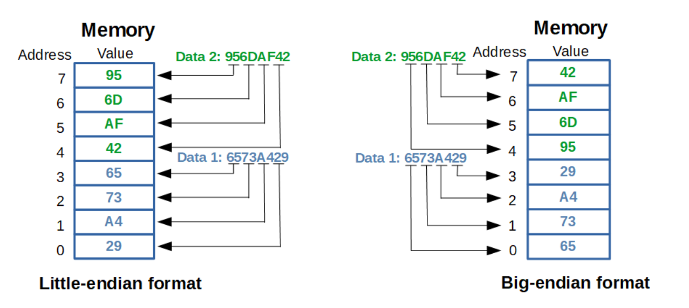

### Q1. What is Endianness? Little and Big
❓ **What is Endianness?** 🤔  

✅ **Endianness** is the order by which `bytes` are stored in computer memory. Endianness tells us whether bytes are represented from left to right or right to left.

    

❓ **How does Endianness work?**
There are two ways Endianness  allows data to be stored in memory:  
📌 *Little-Endian*: Store the `least significant byte` in the `smallest address`.

    

📌 *Big-Endian*: Store the `most significant byte` in the `smallest address`.

    

🔥 **Example:**

    

### Q2. Write C code to check for the endianness of the system
