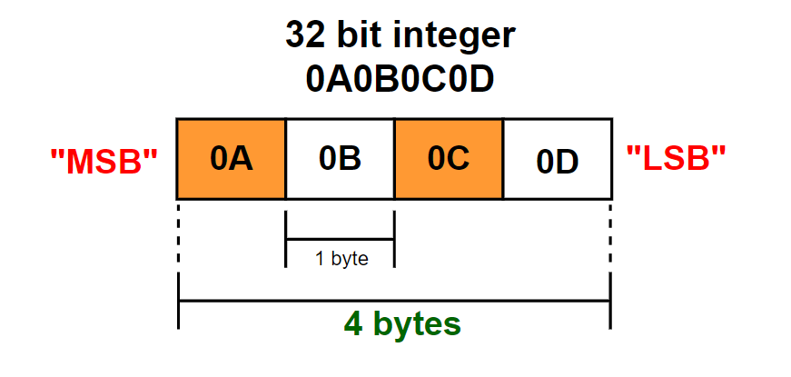

### Reference
- https://deepbluembedded.com/embedded-systems-interview-questions/#google_vignette

Còn nhiều vấn đề khai thác
### Q1. What is Endianness? Little and Big ❓
ⓠ**What is Endianness?** 🤔  

✅ **Endianness** is the order by which `bytes` are stored in computer memory. Endianness tells us whether bytes are represented from left to right or right to left.

    

💡 `Note `: 0A0B0C0D là số hexa

---

❓ **How does Endianness work?**
There are two ways Endianness  allows data to be stored in memory:  
📌 *Little-Endian*: Store the `least significant byte` in the `smallest address`.

    

📌 *Big-Endian*: Store the `most significant byte` in the `smallest address`.

    

🔥 **Example:**

    

### Q2. Write a C program to convert decimal to binary and hexa ❓
~~~c
#include <stdio.h>
#include <string.h>

// Hàm chuyển đổi thập phân sang nhị phân
void Convert_Decimal_to_Binary(int data) {
    char str[33] = "";                          //  32 bit + '\0'
    int index = 0;

    while (data > 0) {
        str[index++] = (data % 2) ? '1' : '0';  // Lưu kết quả bit trực tiếp vào chuỗi
        data = data / 2;
    }

    // Đảo ngược chuỗi 
    int len = strlen(str);
    for (int i = 0; i < len / 2; i++) {
        char temp = str[i];
        str[i] = str[len - 1 - i];
        str[len - 1 - i] = temp;
    }

    printf("Chuỗi nhị phân: %s\n", str);
}

void Convert_Decimal_to_Hexa(int data) {
    char str[10] = "";  
    char temp[2];                               // Chuỗi tạm thời để chứa ký tự chuyển đổi
    
    while (data != 0) {
        int remainder = data % 16;
        data = data / 16;
        
        if (remainder < 10) {
            temp[0] = '0' + remainder;         // Chuyển đổi số thành ký tự
        } else {
            temp[0] = 'A' + (remainder - 10);  // Chuyển đổi 10-15 thành 'A'-'F'
        }
        
        temp[1] = '\0';  
        strcat(str, temp);                     // Nối temp vào chuỗi str
    }
    
    // Đảo ngược chuỗi
    int len = strlen(str);
    for (int i = 0; i < len / 2; i++) {
        char tempChar = str[i];
        str[i] = str[(len - 1) - i];
        str[(len - 1) - i] = tempChar;
    }

    printf("Chuỗi: %s\n", str);
}

int main()
{
    int a = 30;
    Convert_Decimal_to_Binary(a);
    int b = 923;
    Convert_Decimal_to_Hexa(b);
    return 0;
}
~~~
**OUTPUT:**
~~~
Chuỗi nhị phân: 11110
Chuỗi: 39B
~~~

### Q3. Write C code to check for the endianness of the system ❓
🌱🌱🌱 **Explain:** Để có thể nhận biết được hệ thống máy tính đó sử dụng Little-Endian hay Big-Endian thì ta có thể cho 1 giá trị và kiếm tra `byte (LSB)` or `byte (MSB)`.
Trong đoạn code C bên dưới thì tôi đang kiếm tra `byte (LSB)`.
~~~c
#include <stdio.h>

int main()
{
    printf("Kich thuoc cua unsigned int: %zu byte\n", sizeof(unsigned int));
    
    unsigned int value = 312784434; 
    printf("Gia tri hexa cua %u là: %X\n", value, value);
    
    void* ptr1 = &value;
    
    char *ptr = (char*) &value;
    /* 
     * Ép kiểu con trỏ từ unsigned int* sang char* không thay đổi địa chỉ, chỉ thay đổi cách chương trình sẽ 
     * diễn giải dữ liệu mà con trỏ trỏ tới.
     *
     */

    if(*ptr == 0x32){
        printf("Little-Endian");
    }
    else if(*ptr == 0x12){
        printf("Big-Endian");
    }

    return 0;
}
~~~
**OUTPUT**
~~~
Kich thuoc cua unsigned int: 4 byte
Gia tri hexa cua 312784434 là: 12A4B632
Little-Endian
~~~
### Q4. Endianness (Conversion) ❓
~~~c
#include <stdio.h>
#include <stdint.h> // Để sử dụng uint32_t

uint32_t ChangeEndianness(uint32_t value);

int main(){
    uint32_t little_endian = 0x0A0B0C0D; // Giá trị hệ thập lục phân
    uint32_t big_endian = 0;
    
    big_endian = ChangeEndianness(little_endian);
    
    printf("little_endian = %08X\n", little_endian); 
    printf("big_endian = %08X\n", big_endian); 
    
    return 0;
}

uint32_t ChangeEndianness(uint32_t value){
    uint32_t result = 0;
    result |= (value & 0x000000FF) << 24; 
    result |= (value & 0x0000FF00) << 8; 
    result |= (value & 0x00FF0000) >> 8;  
    result |= (value & 0xFF000000) >> 24; 
    return result;
}
~~~
**OUTPUT**
~~~
little_endian = 0A0B0C0D
big_endian = 0D0C0B0A
~~~

### Q5. What’s Bit Banging? ❓
