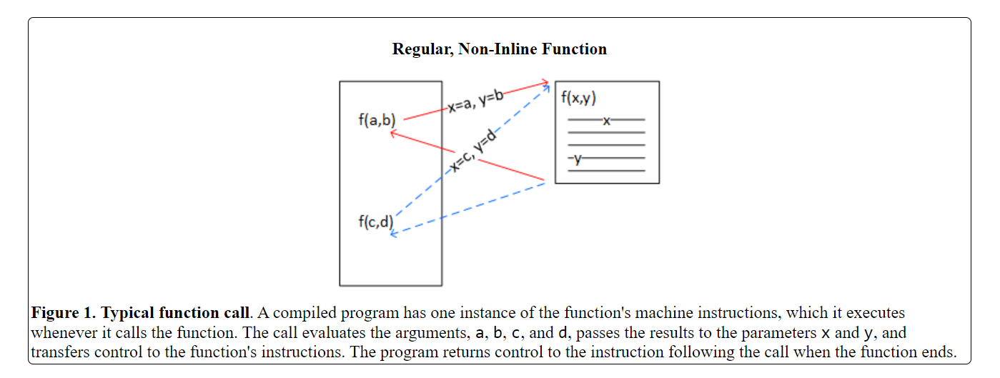
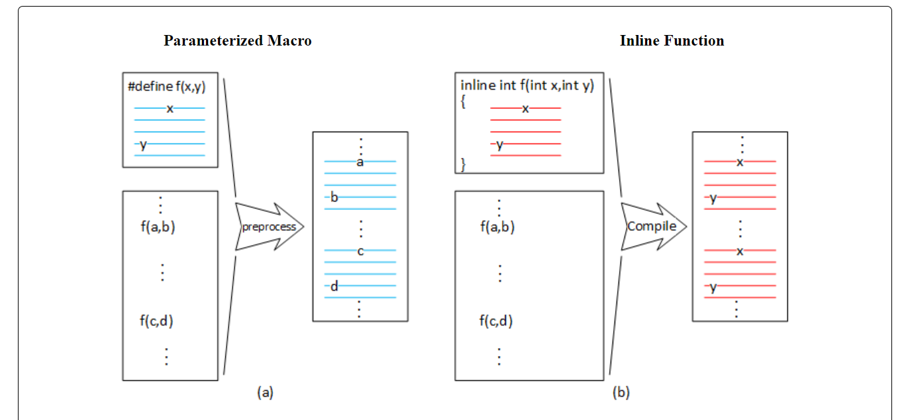
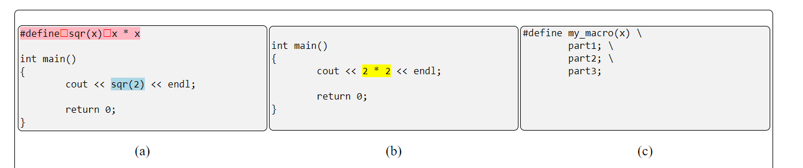
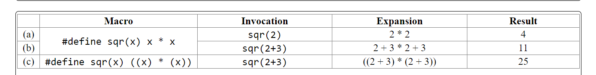
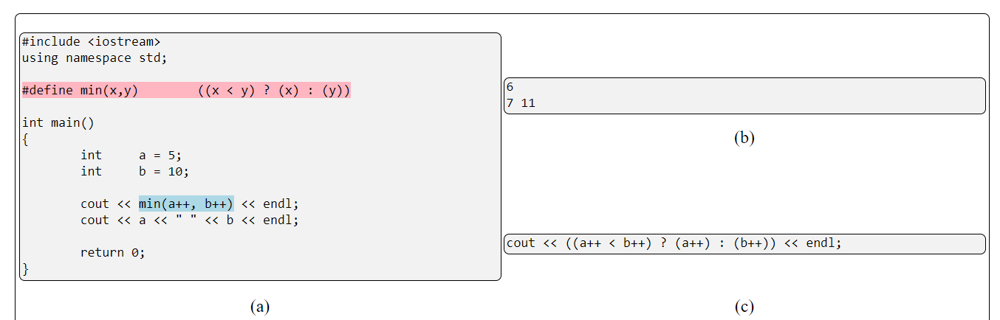
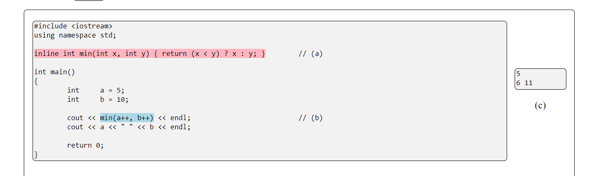
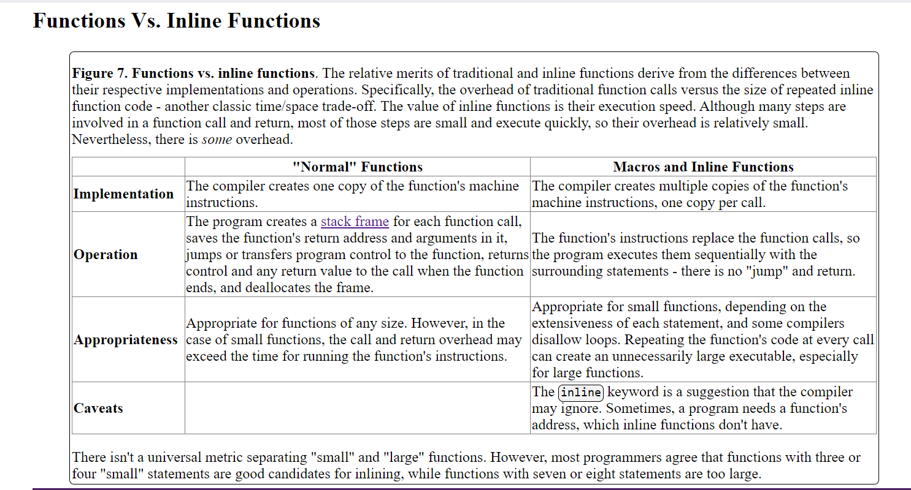

# 
## Reference
- https://icarus.cs.weber.edu/~dab/cs1410/textbook/6.Functions/inline.html

Macros and inline functions are very different programming constructs, but their purpose and behavior are similar. We first explored macros as one way of making a symbolic constant. In this section, we extend the macro syntax by adding parameters. The preprocessor expands macros by replacing one sequence of characters with another. Specifically, it replaces the macro name with the macro body. Parameterized macros are common in C programs but inline functions typically replace them in C++.

To understand macros and inline functions and why we might use them, we need to know how they differ from "normal" functions.

    

    

Figure 2. Macro vs. inline function. The behavior of parameterized macros (a) and inline functions (b) are very similar, but there are some significant differences.

The preprocessor expands macros in place by replacing the macro, f(x,y), with the statements in the macro body. The character strings represented by a and b (including any operators) replace x and y in the expansion. The expansions create one instance of the macro body for every occurrence of the macro "call" in the source code, eliminating control transfer to and from a function.
Inline functions are also expanded in place, replacing the function calls, but the compiler component, not the preprocessor, performs the expansion. There is one copy of the function body for every function call in the source code. However, the program evaluates the arguments and passes the resulting values to the function parameters before the expansion occurs.

## Parameterized Macros
A parameterized macro is an older programming construct used frequently in C but rarely in C++. Nevertheless, you must understand them because you may encounter them in older code, and understanding macros clarifies why their weaknesses drove language designers to create their modern replacements: inline functions.

    

Figure 3.

 From left to right, parameterized macros consist of the #define directive, an identifier or name, a comma-separated parameter list, the replacement text, and ends with a terminating newline character. The preprocessor expands the macro by replacing the name and argument list with the replacement text. During expansion, the preprocessor replaces the macro parameters embedded in the replacement text with the corresponding arguments; all other characters in the replacement text are copied verbatim to the preprocessor output.
 
a. Parameterized macros have a rigid syntax (highlighted in pink). From left to right, they consist of the #define directive, an identifier or name, a comma-separated parameter list, the replacement text, and a terminating newline character. The spaces represented by the red boxes are required, consisting of one or more space or tab characters. The syntax does not permit spaces or tabs between the macro's name and the leftmost parenthesis. (The preprocessor doesn't report an error if there is a space, but the output is incorrect.) Modern preprocessors allow spaces between the parameters, but older ones do not. The macro invocation (light blue) looks like a function call but behaves differently.

b. The preprocessor output: During expansion, the preprocessor replaces the parameter, x, with the macro argument, 2, while copying the multiplication operator and spaces verbatim.

c. A macro definition ends with a newline character. Therefore, to create a macro spanning multiple lines, programmers must escape or "hide" any newline characters within the definition. The escape character, \, "hides" exactly one character, making it crucial not to have an invisible space or tab character following the backslash. Be cautious when placing comments or other characters in the replacement text, as the preprocessor includes in the macro expansion.

    

Figure 4.
Correctable macro errors. Function arguments are expressions; the program evaluates them before calling the function and passes the results to the function's parameters. However, macros are simple textual replacements the preprocessor completes before the compiler component runs, which can lead to some unexpected results.
If we invoke the sqr macro with a constant or simple variable argument, the macro expansion behaves as expected.
However, invoking the macro with a more complex argument can produce unexpected results. The problem is that during the expansion, the characters 2+3 replace the parameter x as both the left- and right-hand operands of the multiplication operator. Multiplication has a higher precedence than addition, so 3*2 is evaluated before either addition operation.
We can correct this problem with a generous application of grouping parentheses.

While parentheses can solve simple macro errors, there are others that no amount of parentheses can fix. Examine the following program and see if you can spot the error. You might find it helpful to review the `auto increment` and the `conditional` operators.

    

Figure 5. 
Uncorrectable macro errors. We expect the macro to print the smallest of 5 and 10, which is 5. Furthermore, we expect the code to increment the 5 and 10 to 6 and 11, respectively, and then print those values with the second cout statement. The output demonstrates that the macro does not behave as expected.
a. The macro definition (highlighted in pink) and invocation (highlighted in blue).

b. The program output.

c. It's easier to see the problem in the expanded text, which the program evaluates as follows:
  1. For a=5 and b=10, (a++ < b++) is true.
  2. As a side effect, it increments a and b, so a=6 and b=11.
  3. As the first expression is true, the value of the conditional operation is 6, but a second side effect, (a++), increments a again.
  4. Finally, the program prints the values saved in a and b.

Although appearing similar, macro invocations are not function calls. Programs evaluate function arguments before calling the function, but the preprocessor expands macro arguments before the compiler can generate code to evaluate them. Problems with macros, like the one illustrated here, spurred the development of improved techniques.

## Inline Functions
Inline functions answer the problem but are almost anticlimactic in their simplicity and application compared to macros. Programmers create inline functions with the `inline` keyword.

    

Figure 6.
Inline function example. Unlike macros, inline functions are "true" C++ functions, consisting of a header and body. The body often requires fewer parentheses than a macro while still avoiding the problems of unwanted side effects. Choosing whether or not to make a "small" function (three or four statements) inline is often a matter of personal taste, but we should not inline "large" functions (more than six or seven statements). Furthermore, inlining a function is just a suggestion, which the compiler may accept or reject.

a. Inline functions begin with the inline keyword, but it is a suggestion that the compiler may choose to ignore. The header includes the return type, function name, and the parameter list. The program type checks the parameters and return value, completing any necessary type promotions. Inline functions are typically short and often written on a single line. Nevertheless, programmers can write them on multiple lines without escaping or "hiding" the newline characters.
b. lthough the program evaluates the arguments before calling the function, recall that the post-increment operator "uses" the saved value before incrementing it. So, the call passes 5 and 10 to the function and then increments the values held in a b.
c. The correct and expected program output.

    

