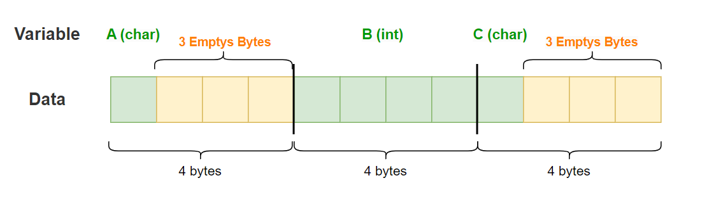
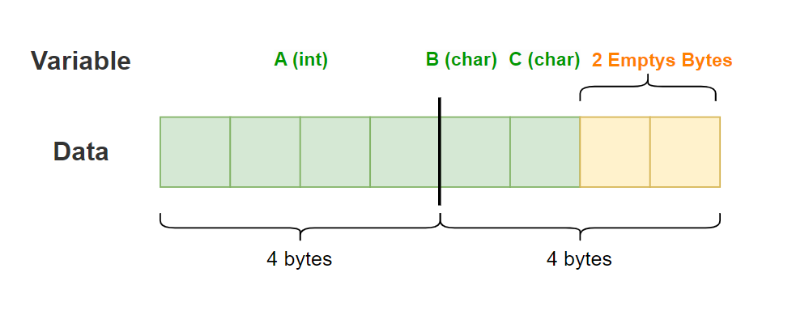
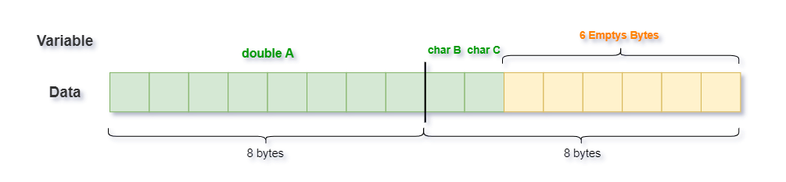
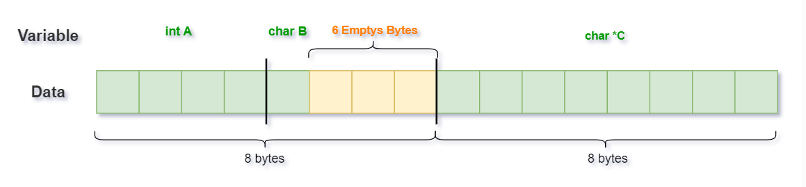

# Structure padding questions in C

#### 1. 
~~~cpp
#include <stdio.h>
typedef struct
{
    char A;
    int B;
    char C;
} InfoData;
int main(int argc, char *argv[])
{
    //Calculate size of structure
    printf("\n Size of Structure = %ld bytes\n\n",sizeof(InfoData));
    return 0;
}
~~~
**Output:** 12 bytes

    

-------------------
#### 2. 
~~~cpp
#include <stdio.h>
typedef struct
{
    int A;
    char B;
    char C;
} InfoData;
int main(int argc, char *argv[])
{
    //Calculate size of structure
    printf("\n Size of Structure = %ld bytes\n\n",sizeof(InfoData));
    return 0;
}
~~~
**Output:** 8 bytes

    

-------------------
#### 3. 
~~~cpp
#include <stdio.h>
typedef struct
{
    double A; // 8-byte
    char B;   // 1-byte
    char C;   // 1-byte
} InfoData;
int main(int argc, char *argv[])
{
    //Calculate size of structure
    printf("\n Size of Structure = %ld bytes\n\n",sizeof(InfoData));
    return 0;
}
~~~
**Output:** 16 bytes

    

--------------
#### 4.
~~~cpp
#include <stdio.h>

typedef struct
{
    int A;
    char B;
    char *C; //In 64-bit computer systems, the size of the pointer is 8 bytes
} InfoData;

int main(int argc, char *argv[])
{
    InfoData test;
    test.C = NULL;  // Avoid wild pointer
    
    //Print addresses of member variables of struct InfoData
    printf("\nAddress of variable A: %p", (void*)&test.A);
    printf("\nAddress of variable B: %p", (void*)&test.B);
    printf("\nAddress of variable C: %p", (void*)&test.C);
    
    // Size of the structure: 
    printf("\nSize of struct InfoData = %ld bytes", sizeof(InfoData));

    return 0;
}
~~~
**Output**:
~~~cpp
Address of variable A: 0x7ffcec5c5ee0
Address of variable B: 0x7ffcec5c5ee4
Address of variable C: 0x7ffcec5c5ee8
Size of struct InfoData = 16 bytes
~~~

    

